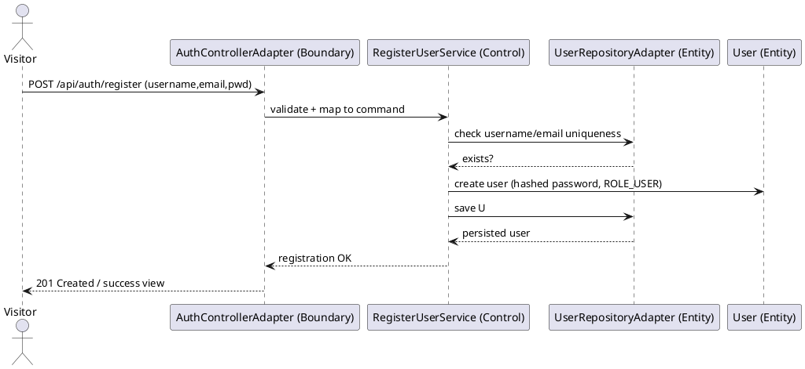
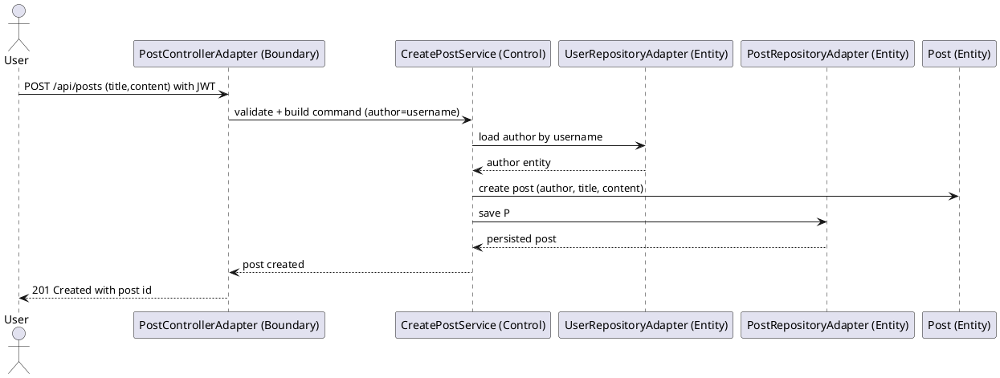
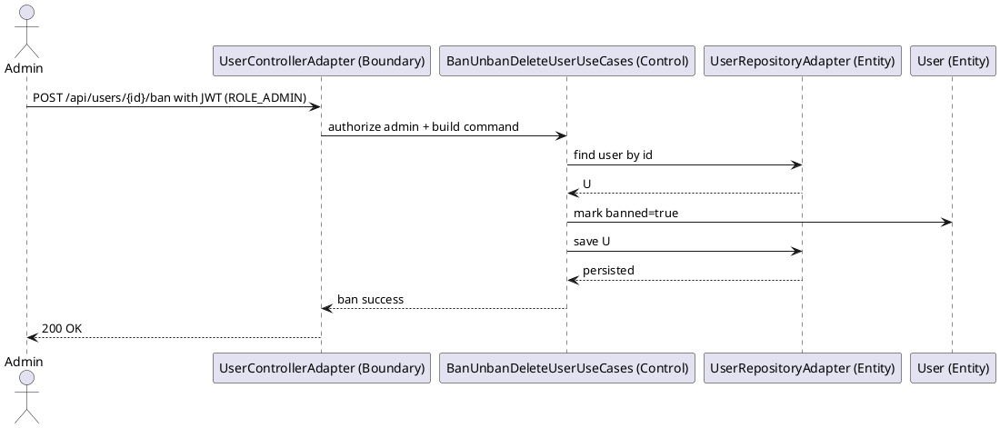

# Sequence Diagrams – BiUrSite Knowledge Sharing Platform

## 1. Author Information

- Full Name: Hang Kheang Taing
- Student ID: 618055
- GitHub Repository URL: https://github.com/Kheang1409/biursite-mini

---

## 2. Overview

This lab provides sequence diagrams for three major use cases of BiUrSite. Each diagram highlights boundary (controllers), control (use-case services), and entity (repositories/entities) participants.

---

## 3. UC-01: Register Account (Visitor → User)

---

## 4. UC-02: Create Post (Authenticated User)

---

## 5. UC-03: Admin Ban User (Moderation)

---

## 6. Notes

- Boundaries map to controllers already present in the codebase.
- Controls correspond to use-case services in the application layer.
- Entities/repositories reflect the JPA adapters and domain entities used at runtime.
- Authentication/authorization is enforced before controller delegates; omitted from arrows for clarity.

---

## 7. Sequence Diagrams

### UC-01: Register Account

.png>)

### UC-02: Create Post

.png>)

### UC-03: Admin Ban User

.png>)
