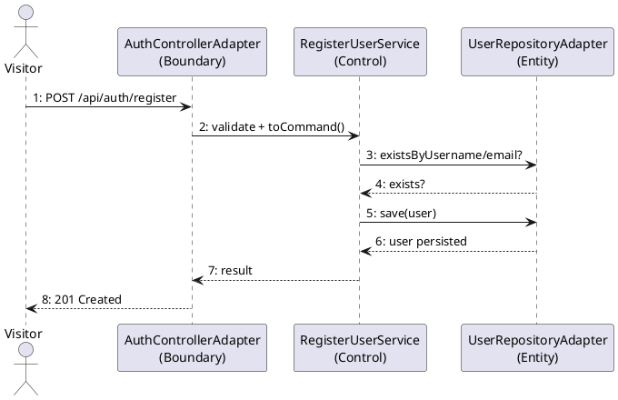
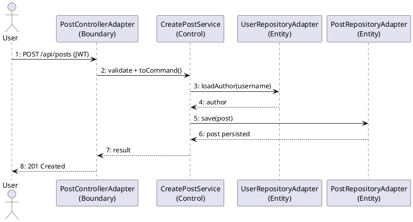
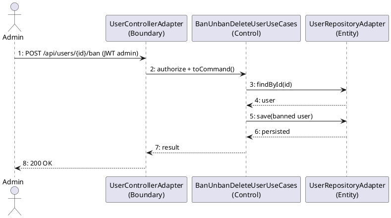
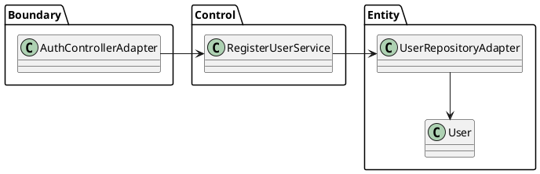
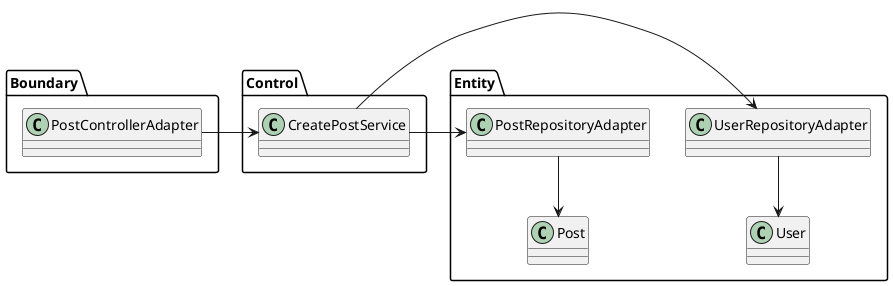
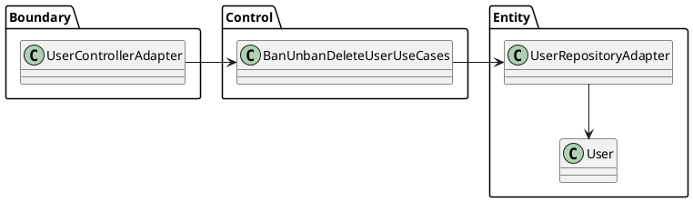

# Lab05 – Collaboration & VOPC Diagrams (BiUrSite)

## 1. Author Information

- Full Name: Hang Kheang Taing
- Student ID: 618055
- GitHub Repository URL: https://github.com/Kheang1409/biursite-mini

---

## 2. Overview

This lab provides collaboration (communication) and VOPC (View Of Participating Classes) diagrams for key BiUrSite use cases. The models follow boundary/control/entity stereotypes used in earlier labs.

Use cases covered:

- UC-Register Account
- UC-Create Post
- UC-Admin Ban User

---

## 3. Collaboration Diagrams

### 3.1 UC-Register Account

### 3.2 UC-Create Post

### 3.3 UC-Admin Ban User

---

## 4. VOPC (View Of Participating Classes)

Each diagram highlights participating boundary, control, and entity classes for the use case.

### 4.1 UC-Register Account VOPC

### 4.2 UC-Create Post VOPC

### 4.3 UC-Admin Ban User VOPC

---

## 5. Notes

- Boundary classes map to controllers; Control classes to use-case services; Entity classes to repository adapters and domain entities.
- Numbering in collaboration diagrams follows message order per lesson guidance.
- Security steps (JWT/form auth) happen before controller invocation and are implicit in these diagrams.

---

## 6. Embedded Diagrams

### Collaboration Diagrams

#### UC-Register Account

.png>)

#### UC-Create Post

.png>)

#### UC-Admin Ban User

.png>)

### VOPC Diagrams

#### UC-Register Account

#### UC-Create Post

#### UC-Admin Ban User

